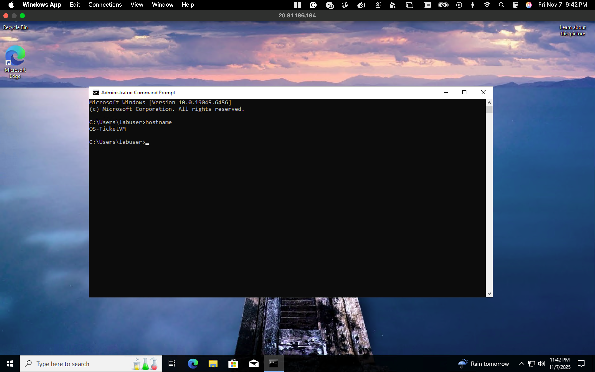
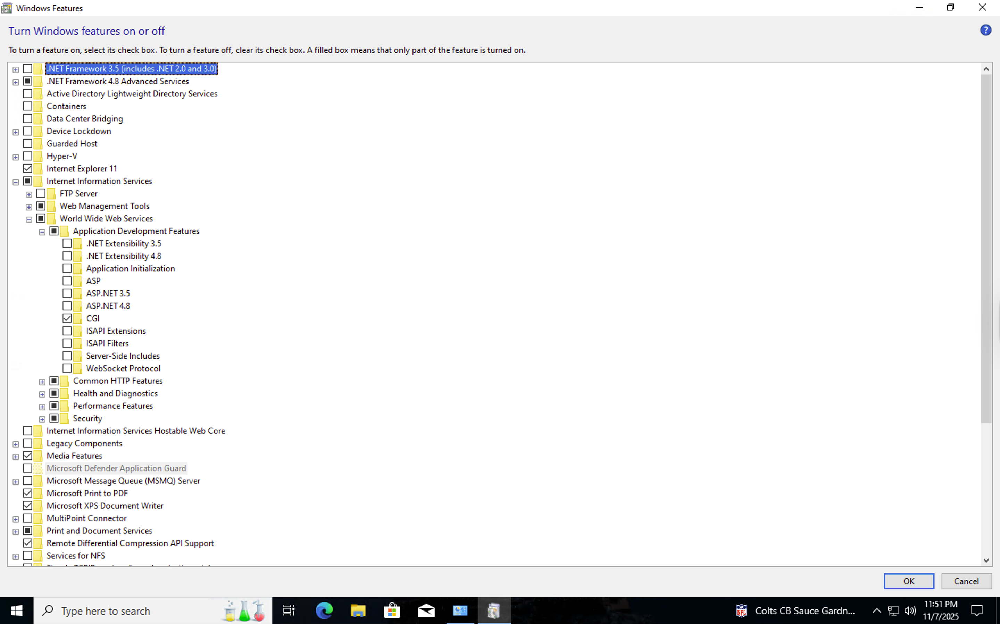
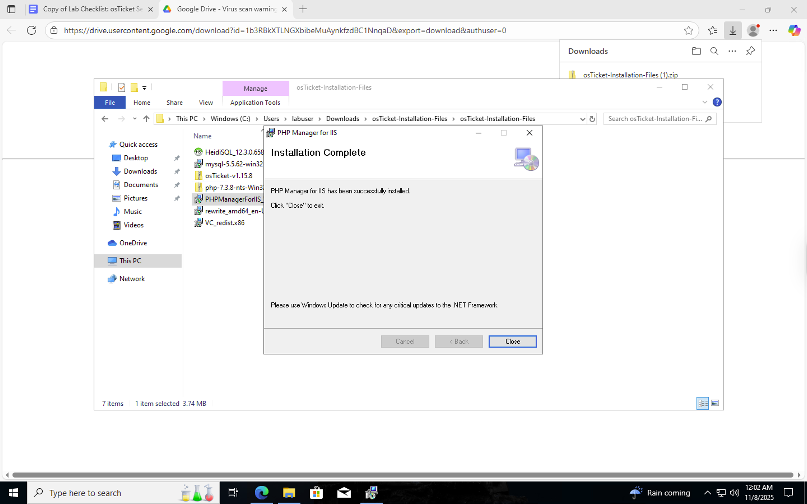
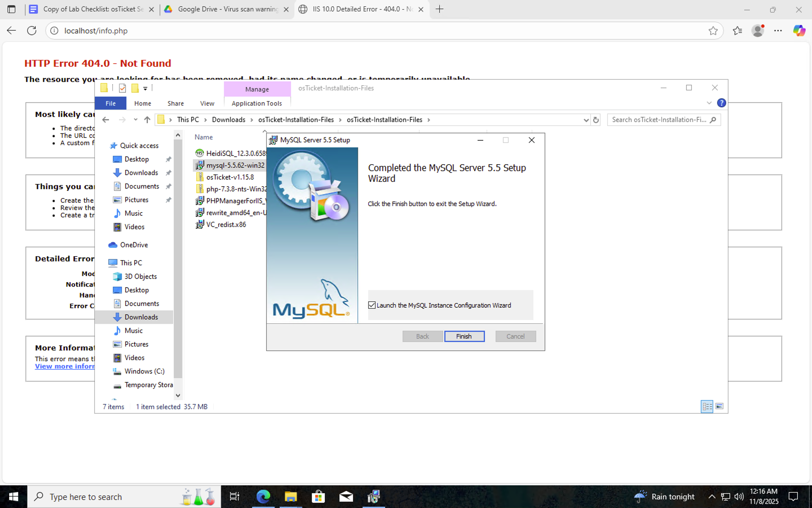
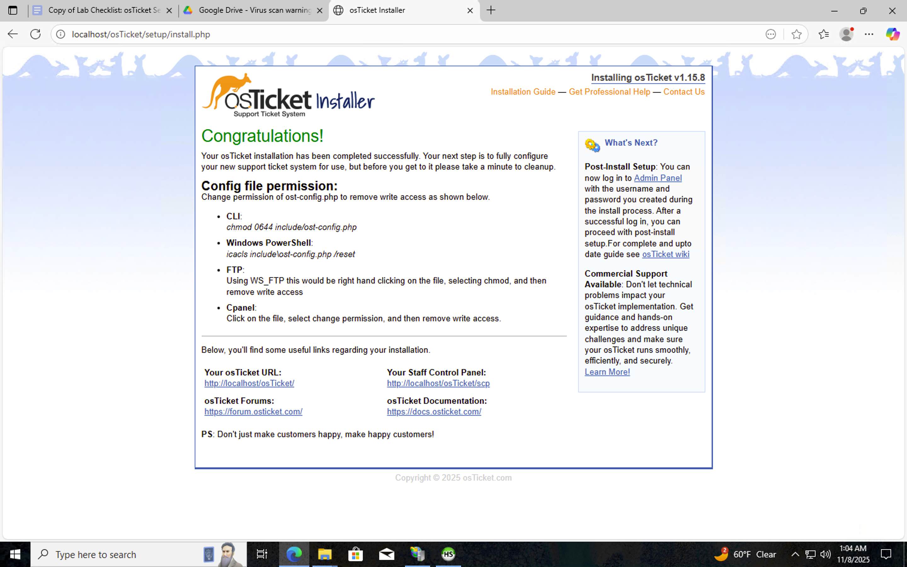

<h1>osTicket - Prerequisites and Installation</h1>
This tutorial outlines the prerequisites and installation of the open-source help desk ticketing system osTicket. 

<h2>Video Demonstration</h2>

- ### [YouTube: How To Install osTicket with Prerequisites](https://www.youtube.com)

<h2>Environments and Technologies Used</h2>

- Microsoft Azure (Virtual Machines/Compute)
- Remote Desktop (RDP) – To connect to the Windows 10 VM
- Internet Information Services (IIS) – Web Server for hosting osTicket
- PHP – Backend support for osTicket
- MySQL – Database for osTicket
- HeidiSQL – Database management GUI

<h2>Operating Systems Used </h2>

- Windows 10</b> (21H2)

<h2>List of Prerequisites</h2>

  	1.	Create a Windows 10 Virtual Machine in Microsoft Azure
	2.	Enable and configure IIS (Internet Information Services)
	3.	Install PHP Manager for IIS and Rewrite Module
	4.	Download and install PHP (v7.3+ recommended)
	5.	Install MySQL Server
	6.	Install HeidiSQL to manage the MySQL database
	7.	Download and extract osTicket to the IIS web root directory
	8.	Configure osTicket permissions and complete setup in the browser

<h2>Installation Steps</h2>

### Step 1: Create and connect to the Windows 10 VM

  

Lorem ipsum dolor sit amet, consectetur adipiscing elit, sed do eiusmod tempor incididunt ut labore et dolore magna aliqua. Ut enim ad minim veniam, quis nostrud exercitation ullamco laboris nisi ut aliquip ex ea commodo consequat. Duis aute irure dolor in reprehenderit in voluptate velit esse cillum dolore eu fugiat nulla pariatur.

---

### Step 2: Install and configure IIS

Lorem ipsum dolor sit amet, consectetur adipiscing elit, sed do eiusmod tempor incididunt ut labore et dolore magna aliqua. Ut enim ad minim veniam, quis nostrud exercitation ullamco laboris nisi ut aliquip ex ea commodo consequat. Duis aute irure dolor in reprehenderit in voluptate velit esse cillum dolore eu fugiat nulla pariatur.

---

### Step 3: Install PHP, MySQL, and osTicket

---

Lorem ipsum dolor sit amet, consectetur adipiscing elit, sed do eiusmod tempor incididunt ut labore et dolore magna aliqua. Ut enim ad minim veniam, quis nostrud exercitation ullamco laboris nisi ut aliquip ex ea commodo consequat. Duis aute irure dolor in reprehenderit in voluptate velit esse cillum dolore eu fugiat nulla pariatur.

## 🧾 About

This project documents the **installation and setup of osTicket**, an open-source support ticket system widely used in IT support and Service Desk operations. It demonstrates understanding of **server setup, IIS configuration, PHP integration, and database management** in a Windows environment.

---
